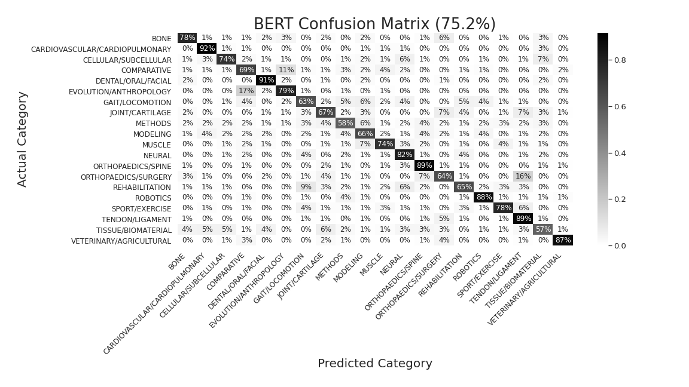

# BiomchBERT 
## Using Google's BERT neural network to automatically classify biomechanics publications

For over 20 years, volunteers in the Biomechanics community searched publication databases for relevant 
articles, categorized them, and shared them via the 
[Biomch-L Literature Update](https://biomch-l.isbweb.org/forum/biomch-l-forums/literature-update). While parts of the 
current Literature Update process are automated (e.g. publication search, parsing of publication information), a 
substantial amount of time is required to go through the papers and categorize them. Neural Networks have performed well
in classification tasks and may be a viable solution to automating the Biomch-L Literature Update process, but large
datasets are needed to train neural networks. Thanks to those who have diligently maintained the Literature Updates over
the years, there are tens of thousands of categorized publications ready to be used to train a neural network!

[BERT](https://ai.googleblog.com/2018/11/open-sourcing-bert-state-of-art-pre.html) is an open-source neural network
developed by Google AI and originally trained on all the text on Wikipedia to discern the relationship between
sentences (semantic similarity) in a given corpus and improve the quality of Google search results. BERT has been used
to improve a computer's ability to accomplish a variety of natural language processing tasks, such as sentiment
analysis, question answering, and document classification. Using BERT to classify biomechanics publications would
reduce the time required to generate the Biomch-L Literature Update. 

In order to fine-tune BERT to classify biomechanics publications, we needed to create a dataset from the previous
Biomch-L Literature Updates. Gary Bruening developed a webscraper that extracted the publication information (title,
abstract, authors, journal) and assigned topic for each Literature Update between 2010-2018. Then, Ryan Alcantara
fine-tuned a [version of BERT trained on text from MEDLINE/PubMed](https://tfhub.dev/google/experts/bert/pubmed/2) to
assign 1 of 20 categories to a given publication. This fine-tuned BERT network, named BiomchBERT, can now be used to
classify new publications based on their title and abstract text. Here is the prediction accuracy of BiomchBERT on
3,400 biomechanics publications: 

 *BiomchBERT has a prediction accuracy of 75.2% across 20 categories (tested on 3,417 publications)*

## Major Dependencies
* [BERT trained on MEDLINE/PubMed](https://tfhub.dev/google/experts/bert/pubmed/2)
* [Tensorflow](https://www.tensorflow.org/install)
* [Biopython](https://biopython.org/wiki/Download)
* [BeautifySoup](https://www.crummy.com/software/BeautifulSoup/bs4/doc/)

## Contributors
- [Ryan Alcantara](https://twitter.com/Ryan_Alcantara_) 
- [Gary Bruening](https://twitter.com/garebearbru)
