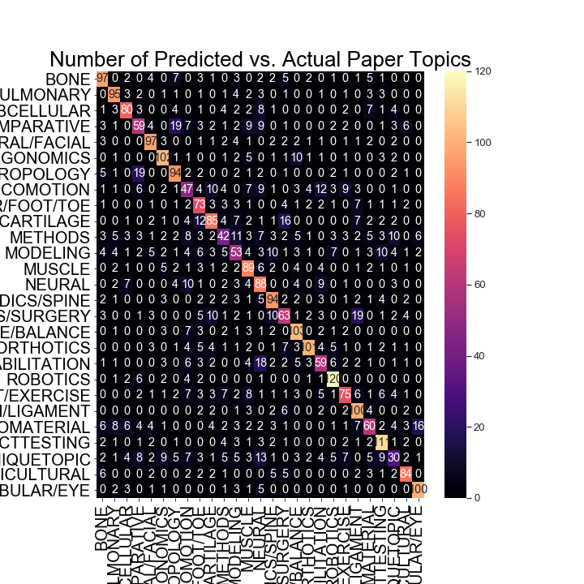

# literature_update
Jupyter script performs pubmed search and prints citation where title hyperlinks to pubmed page via in markdown format. 

Dependencies: 
* biopython package (can be found [here](https://biopython.org/wiki/Download))
* numpy package (can be found [here](https://www.numpy.org/))

## Change search terms

Let's say you want to include fish biomechanics in your search. remove `NOT fish` from:

`search_results = search('(biomech*[Title/Abstract] OR locomot*[Title/Abstract]) AND bone*[Title/Abstract] NOT mice NOT fish NOT bird NOT rat NOT zoo')`

or completely change the `search()` parameters as you would for an [advanced pubmed search](https://www.ncbi.nlm.nih.gov/pubmed/advanced):

`search_results = search('(running) AND biomechanics')`

## Change date range of search

Change the numerical value for `reldate` :  
`reldate = 14, #only within two weeks from now`

